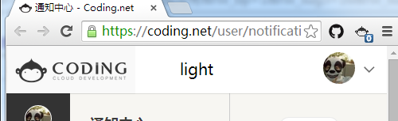

#  Coding.net Notifier

> Chrome extension - Displays your Coding.net notifications unread count

> Inspired by [sindresorhus's github-notifier](https://github.com/sindresorhus/github-notifier-chrome)

## Install

1. Clone this project to local

2. Load this extesion dir to Chrome extension

## License

MIT